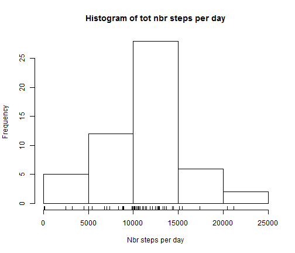
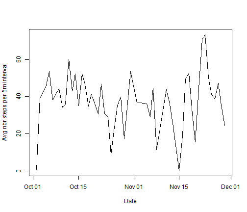
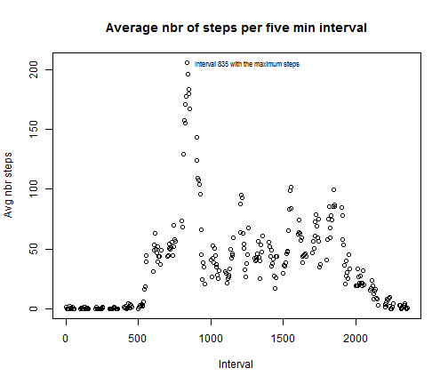
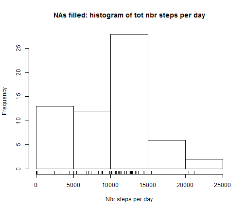
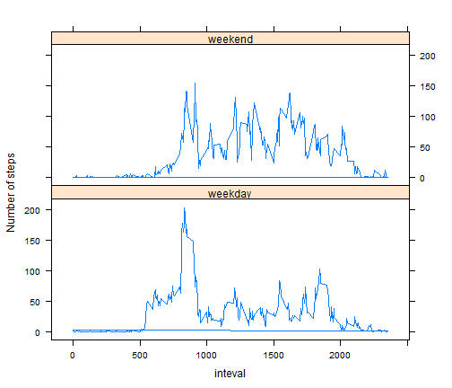

# Reproducible Research: Peer Assessment 1


## Loading and preprocessing the data

```r

setwd("C:\\Users\\Kingsbury\\Documents\\GitHub\\RepData_PeerAssessment1")

# DataLoad
activity <- read.csv("activity.csv", header = TRUE, sep = ",", na.strings = "NA")

## Convert the Date column to date format
activity$date <- as.Date(activity$date, format = "%Y-%m-%d")

# show the table of NAs
table(is.na(activity$steps))
```

```
## 
## FALSE  TRUE 
## 15264  2304
```

## What is mean total number of steps taken per day?

```r

# calc the total nbr steps taken per day
total_nbr_steps_day <- aggregate(activity$steps, by = list(activity$date), FUN = sum)
# rename columns
colnames(total_nbr_steps_day) <- c("date", "nbr_steps")

# calculate mean and median, remove NAs
mean_raw <- mean(total_nbr_steps_day$nbr_steps, na.rm = TRUE)
median_raw <- median(total_nbr_steps_day$nbr_steps, na.rm = TRUE)
```


```r
# print the values to screen
mean_raw
```

```
## [1] 10766
```

```r
median_raw
```

```
## [1] 10765
```


### Histogram of total number of steps taken per day

```r
# draw the histogram
hist(total_nbr_steps_day$nbr_steps[is.na(total_nbr_steps_day$nbr_steps) == FALSE], 
    main = "Histogram of tot nbr steps per day", xlab = "Nbr steps per day")
rug(total_nbr_steps_day$nbr_steps[is.na(total_nbr_steps_day$nbr_steps) == FALSE], 
    ticksize = 0.02)
```

 


## What is the average daily activity pattern?
### Time series plot of the 5-minute interval (x-axis) and the average number of steps taken, averaged across all days (y-axis)

```r
# removing NAs
clean_activity <- subset(activity, is.na(activity$steps) == FALSE)
# calculating
clean_activity$avg_by_date <- ave(clean_activity$steps, clean_activity$date)
# draw the time series plot
```


```r
plot(clean_activity$date, clean_activity$avg_by_date, type = "l", ylab = "Avg nbr steps per 5m interval", 
    xlab = "Date")
```

 

### Which 5-minute interval, on average across all the days in the dataset, contains the maximum number of steps?


```r
# calculate average nbr steps per interval
clean_activity$avg_by_interval <- ave(clean_activity$steps, clean_activity$interval)
# plot average nbr steps per interval show maximum
max(clean_activity[, "avg_by_interval"])
```

```
## [1] 206.2
```

```r
# which interval contains the maximum
with(clean_activity, interval[avg_by_interval == max(avg_by_interval)])[1]
```

```
## [1] 835
```


```r
plot(clean_activity$interval, clean_activity$avg_by_interval, ylab = "Avg nbr steps", 
    xlab = "Interval", main = "Average nbr of steps per five min interval")
text(1250, 205, "Interval 835 with the maximum steps", cex = 0.7)
```

 


## Imputing missing values

### Calculate and report the total number of missing values in the dataset (i.e. the total number of rows with NAs)

```r
# report NAs
colSums(is.na(activity))
```

```
##    steps     date interval 
##     2304        0        0
```

### New data set with imputed values

```r
# load a time series library zoo
library(zoo)
```

```
## 
## Attaching package: 'zoo'
## 
## The following objects are masked from 'package:base':
## 
##     as.Date, as.Date.numeric
```

```r
# convert the data frame into a time series object for usage in zoo
activity_imputed <- read.zoo(activity, index.column = 2, format = "%Y-%m-%d")
```

```
## Warning: some methods for "zoo" objects do not work if the index entries
## in 'order.by' are not unique
```

```r

# fill NAs be using median of the five minutes intervals in the zoo ts
# object
activity_filled <- na.aggregate(activity_imputed, by = 3, FUN = median)

## helper function to convert a time series object to a dataframe
zoo.to.data.frame <- function(x, index.name = "date") {
    stopifnot(is.zoo(x))
    xn <- if (is.null(dim(x))) 
        deparse(substitute(x)) else colnames(x)
    setNames(data.frame(index(x), x, row.names = NULL), c(index.name, xn))
}

# convert ts object back to a dataframe
activity_filled_df <- zoo.to.data.frame(activity_filled)
# check NAs
table(is.na(activity_filled_df$steps))
```

```
## 
## FALSE 
## 17568
```

### Calculations of median and mean with new NAs filled dataset

```r

# calc the total nbr steps taken per day
total_nbr_steps_day_fill <- aggregate(activity_filled_df$steps, by = list(activity_filled_df$date), 
    FUN = sum)
# rename columns
colnames(total_nbr_steps_day_fill) <- c("date", "nbr_steps")

# calculate mean and median, remove NAs
mean_na_filled <- mean(total_nbr_steps_day_fill$nbr_steps, na.rm = TRUE)
median_na_filled <- median(total_nbr_steps_day_fill$nbr_steps, na.rm = TRUE)
```

### Do these values differ from the estimates from the first part of the assignment? 


```r
mean_raw - mean_na_filled
```

```
## [1] 1412
```

```r
median_raw - median_na_filled
```

```
## [1] 370
```

```r

## Yes, there is a difference between mean/median before and after filling of
## NAs
```


### Histogram of total number of steps taken per day

```r
# draw histogram
hist(total_nbr_steps_day_fill$nbr_steps[is.na(total_nbr_steps_day_fill$nbr_steps) == 
    FALSE], main = "NAs filled: histogram of tot nbr steps per day", xlab = "Nbr steps per day")
rug(total_nbr_steps_day_fill$nbr_steps[is.na(total_nbr_steps_day_fill$nbr_steps) == 
    FALSE], ticksize = 0.02)
```

 


## Are there differences in activity patterns between weekdays and weekends?
### Create a new factor variable in the dataset with two levels - "weekday" and "weekend" indicating whether a given date is a weekday or weekend day


```r
# create a new column with weekdays
activity_filled_df$weekdays <- weekdays(activity_filled_df$date)

# create a new column with two values weekday and weekend
activity_filled_df[((activity_filled_df[, 4] == "Saturday") | (activity_filled_df[, 
    4] == "Sunday")), "wd"] <- "weekend"
activity_filled_df[(!((activity_filled_df[, 4] == "Saturday") | (activity_filled_df[, 
    4] == "Sunday"))), "wd"] <- "weekday"
# new column with averages per 5 min interval
activity_filled_df$ave <- ave(activity_filled_df$step, activity_filled_df$interval, 
    activity_filled_df$wd)
```

### Make a panel plot containing a time series plot (i.e. type = "l") of the 5-minute interval (x-axis) and the average number of steps taken 

```r

library(lattice)

xyplot(activity_filled_df$ave ~ activity_filled_df$interval | activity_filled_df$wd, 
    layout = c(1, 2), xlab = "inteval", ylab = "Number of steps", type = "l")
```

 


